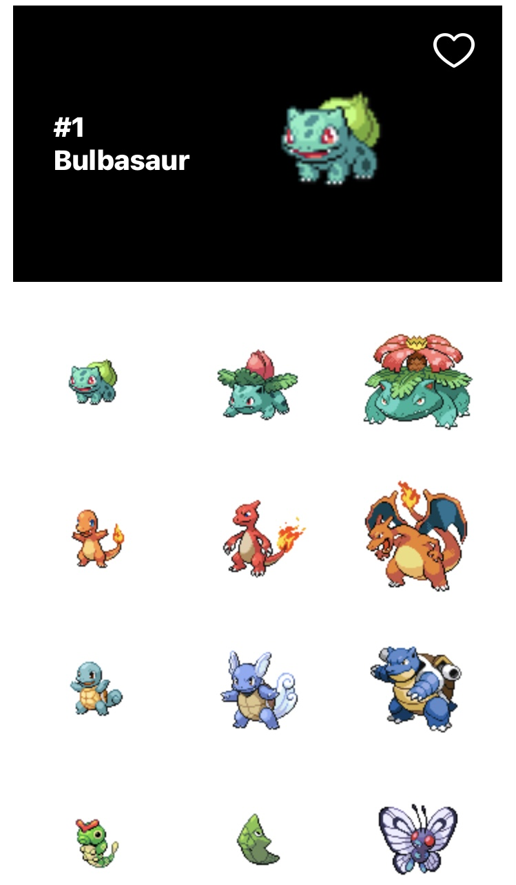
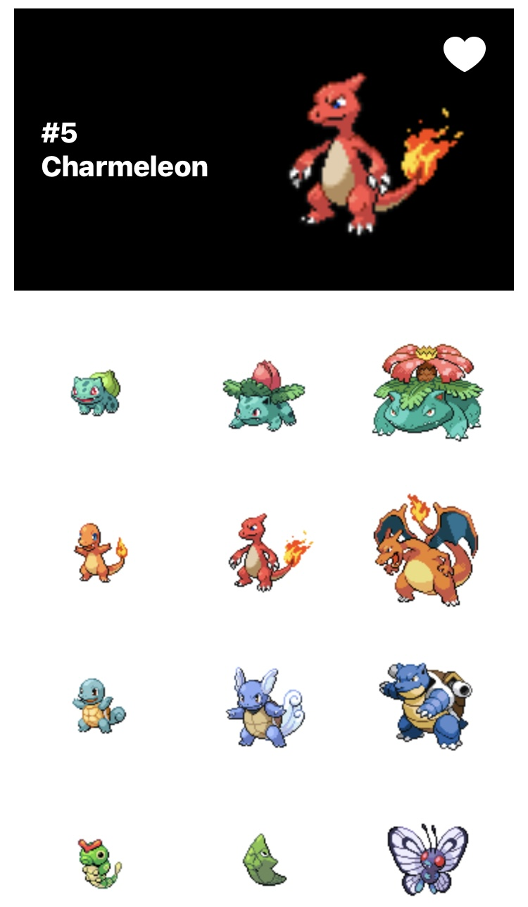

# Pokedex


A Pokédex iOS app implemented with SwiftUI!

<p float="left">
  
  
  
</p>

[Demo Video](Demos/Demo_Video.mov)

## 🚀 Setup Guide
1. Clone the repo:
```
git clone https://github.com/fyy26/Pokedex.git
```
2. Open the project (`Pokedex/Pokedex.xcodeproj`) in XCode (version 14 or above).
3. Select build destination (Product | Destination) as a connected iPhone device or one of the iPhone simulators.
4. Build and run the app.

## 🌟 Features
* Display all pokémons in a scrollable grid by order of ID.
  * Fetch pokémons in batches of 20; fetching is triggered when the user continues to scroll at the end of the scroll view.
* Tap any pokémon in the grid to display a bigger image along with simple details including ID and name in the top stage.
  * The sprite displayed in the stage is animated.
  * The user can like the selected pokémon by tapping on the heart icon.
    * Currently, this feature is just a front-end proof of concept, and the collection of liked pokémons is only persistent
    while the app is open. To fully implement this feature, it should be connected with a remote backend or local storage
    to provide persistence. There can also be an in-app page displaying the list of liked pokémons.

## 🔮 Implementation Insights
* SwiftUI is chosen over Storyboard such that version control, code management and code packaging is easier. SwiftUI
also allows the code to run on multiple iOS platforms (macOS, iOS, iPad apps) and on all supporting device sizes without
autolayout issues<sup>[[1]](https://medium.com/technology-nineleaps/swift-ui-or-storyboard-675ff2b40829)</sup>.
* The app maintains the list of pokémon information fetched in memory because the size of text data of 1154 pokémons is small.
* Currently, each pokémon sprite image is fetched in synchronous completion order such that the grid is populated in
the correct order. An alternative solution to build an ordered list of `PokemonDetail` objects was to populate the list
with dummy values first, then insert the fetched results at their corresponding indices prompted by ID. However, the speed
increase was not significant, and the indices can be hard to maintain if the app later needs to discard and re-fetch
previous pages.
  * Several different approaches of rendering new grid pages from an ordered `PokemonDetail` object list all result in
  a slight visual lag at the moment of fetching. A potential optimization is to use the result of the first API call
  (which fetches just the list of pokémon names with their detail URLs) to populate the grid instead of waiting for the
  detail fetches to complete to start building the grid. Each grid item can be an instance of a custom view which shows
  an image placeholder at the beginning and keeps track of its own pokémon name and details URL. Each custom grid item
  view then fires its own details API call to fetch the sprite image for itself and replace the image placeholder.
* The `AsyncImage` native API caches fetched images automatically with some simple configuration<sup>[[2]](https://www.avanderlee.com/swiftui/downloading-caching-images/)</sup>.
Since there are only 1154 pokémons and each sprite image is 4.4 KB, the collection of all images takes only 5077 KB or 5 MB,
which is equal to the average size of a single photo taken by a modern phone. Hence, the app should cache at least the most
recent few hundreds of pokémon sprite images, if not all, to provide a seamless user experience for the home page at low
storage cost.

## 💭 TODOs/Ideas
* Add a pokémon details page; tap on stage to see more details
* Add app icon
* Search by name feature
  * Store the list of names locally
    * There's only a thousand pokémons => max 5-6 kb of storage, so storing the list instead of requesting it from API
    every time is the better choice.
  * Iterate through list of names and do prefix matching, display the search results/suggestions in a list.
  * Once the user taps on a search result (name), query the pokémon details and go to the pokémon detail page.

## 👩🏻‍💻 Author
* [Yuying Fan](https://github.com/fyy26)

## 📖 References
* [Design+Code - SwiftUI Advanced Handbook HTTP Request](https://designcode.io/swiftui-advanced-handbook-http-request)
* [Stack Overflow - Pull down to refresh data in SwiftUI](https://stackoverflow.com/questions/56493660/pull-down-to-refresh-data-in-swiftui/65100922#65100922)
* [SwiftLee - Downloading and Caching images in SwiftUI](https://www.avanderlee.com/swiftui/downloading-caching-images/)
* [AppCoda - Adding a Launch Screen in Swift Projects](https://www.appcoda.com/launch-screen-swiftui/)
